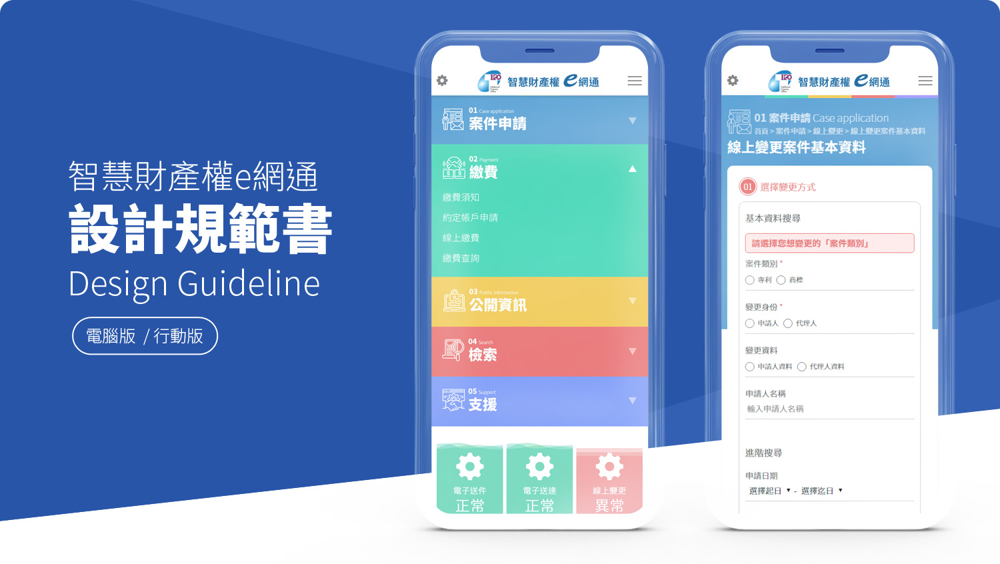

# 設計規範書 Design Guideline

## 簡介 

### 文件目標

本文件主要針對智慧財產權e網通外部入口網站\(以下簡稱：本網站\)所制定的UI/UX\(User Experience，使用者體驗\)設計規範，目的為提供未來相關系統開發時，在UI/UX部分達到一致性的數位服務之使用體驗。

### 文件設計方向 

本網站以五大服務區塊：『案件申請』、『繳費』、『公開資訊』、『檢索』、『支援』作為核心功能，提供智慧財產權e網通相關服務入口，以引導操作為主的方式規劃設計，在面對以功能及服務為主的網站設計時，避免使用過多的裝飾，而是以色塊方式區分出各單元與功能元件，採用極簡風的扁平化設計，讓使用者的操作體驗上沒有多餘的因素影響。使用MegaMenu展開網站整體選單，方便各項功能的選擇，注重文字、色彩與簡易圖形間的編排設計，以次理念貫徹整個網站服務。 

在面對包含次選項的內容時，以視覺區隔的ICON表達可選擇的服務項目，在包含作業流程的頁面，則以引導的互動選擇讓使用者完成選項，避免在面對陌生的選項時發生選擇困難。在各種頁面表單的編排上，注意文字的提示與範例，幫助使用者順利完成表單填寫。 

**智慧財產權e網通 設計規範** 包含了以下內容：‌

1. 使用體驗設計原則 [➥](zeng-jia-yi-ge-ye-mian-shang-chuan.md)
2. 通用性設計 [➥](zeng-jia-yi-ge-ye-mian-shang-chuan.md)
3. 資訊架構 [➥](zi-xun-jia-gou-information-architecture.md)
4. 視覺風格設計方式 [➥](feng-ge-style/)
5. 佈局方式介紹 [➥](nei-rong/)
6. 模板使用規範 [➥](mo-ban/)
7. 元件使用方式 [➥](yuan-jian-component/)

## 參與對象 

### ​ Designer 

不論是使用者體驗設計師 \(UX Designer\)或使用者介面設計師 \(UI Designer\)，皆可善用規範中包含的所有設計規範、風格與元件，進行設計延伸並轉化並達到「智慧財產權e網通」之網站整體一致性。

### ​ Planner 

服務規劃者，即智慧財產局的業務權責的所屬單位，在規劃與『智慧財產權e網通』相關的業務與服務流程時，可善用本規範中的使用經驗設計原則，以確保新業務跟價值主張互為呼應。

### ​ Developer 

不論是前端或後端的程式開發人員，皆可參考本規範中的資訊架構、互動模式以及設計元件等內容，來進行前端互動、資料驗證、內容上稿等功能的開發實作。

## 版本 

2​019.09.01

