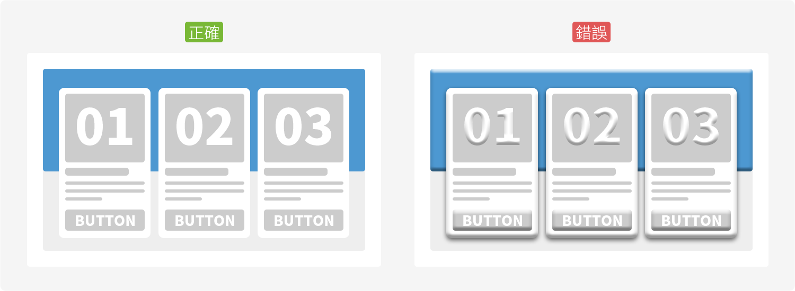

# 風格 Style

智慧財產權e網通使用扁平化的設計方式來呈現，並遵循以下5大規範進行設計與延伸。

1. 色彩 Color [➥](se-cai-color.md)
2. 文字 Font [➥](wen-zi-font.md)
3. 圖標 Iocn [➥](tu-biao-icon.md)
4. 影像 Image [➥](ying-xiang-photo.md)
5. 陰影 Shadow [➥](yin-ying-shadow.md)

## 為何使用扁平化設計？

### 資訊

扁平化設計捨棄了過於複雜的修飾，將重點放在排版與資訊的呈現，簡單直白的將資訊傳達給使用者，因此在扁平化的設計上會更加注重功能的優化，並減少不必要的視覺元素減少對資訊的干擾。

### 效能

在網頁讀取資料時，不必載入過多的圖片增加載入時間，相較之下扁平化會有較佳的表現。無論在加載或者在不同解析度的裝置上，扁平化都能夠完美的適應，不會出現圖片模糊失真問題。

