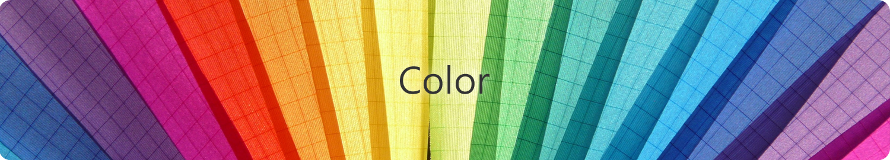
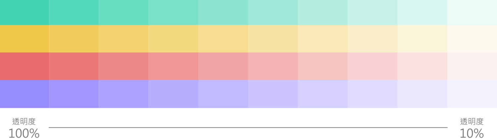

# 色彩 Color

## 主色 

設定的主色能夠在網站風格配色達到一致性。‌

### ​ 鈷藍色 

鈷藍色 色碼 \[ \#005798 \]‌

引用[智慧財產權e網通](https://tiponet.tipo.gov.tw/TipoMenu/)企業示別標章之鈷藍色做為主色，使企業識別標章與網站兩者合而為一。鈷藍色可以帶給人們沉穩、寂靜與科技感的情緒與感受。‌

### ​ 純白色 

純白色 色碼 \[ \#FFFFFF \]‌

為了給予使用者良好的閱讀體驗，選用白色做為背景色，閱讀資訊時畫面的對比較為清晰且銳利。白色可以帶給人們清廉、純潔、光明的情緒與感受。‌

## 單元色 

單元色主要用來將各個主要服務做出區別，來達到增加使用者印象之作用。以下為本服務中各單元所定義的主要顏色：

| Color Name | Color Code | Corresponding Unit |
| :--- | :--- | :--- |
| ​ 水藍色 | \#4D98D1 | 案件申請 |
| ​ 碧綠色 | \#41D4B3 | 繳費 |
| ​ 金黃色 | \#F0C74A | 公開資訊 |
| ​ 銀紅色 | \#E86A6A | 檢索 |
| ​ 虹膜色 | \#978CFC | 支援 |
| ​ 藍漸層 | \#2fA4DB/\#005798 | 會員資料 |

由以上顏色做為背景色之情形時，將統一使用純白色\(\#FFFFFF\)做為文字顏色。‌

## 輔色 

輔色主要用來提醒、強化或凸顯按鈕或元素，並且與主色交互使用。下面是本服務中應用到的輔色：

| Color Name | Color Code | Brief |
| :--- | :--- | :--- |
| ​ 淺灰色 | \#EEEEEE | 頁尾底色 / 備註區塊底色 / 頁籤底色 |
| ​ 灰色 | \#CCCCCC | 框線 / 區塊分隔線 / 次要按鈕 |
| ​ 深灰色 | \#777777 | 備註文字 |
| ​ 黑色 | \#333333 | 內容文字顏色 |
| ​ 青藍色 | \#2FA4DB | 表格表頭 / 目前頁籤 |

## 擴充色盤 

除了輔色外，我們也可以透過改變明度來產生更多色彩供畫面使用。除了輔助的色彩色相外，我們也可以透過明度的改變，來延伸我的色彩應用系統。

