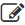
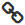
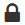

# 圖標 Icon


## 大類別圖標


在主類別的代表圖標將採用SVG動畫的表現方式來增加識別性。在首頁呈現尺寸以78px\*78px為標準，而內頁將圖標尺寸縮減為52px\*52px來對應文字呈現。

如需引用參數請前往「[元件 - SVG](../yuan-jian-component/svg-dong-hua.md)」

## 圖標選擇建議

為了達到風格一致性與減少流量的要求，網站內圖標盡可能取用以下網址當中 Icon Font。使用時**必須達到圖文相互對應之要求**，以避免給予使用者錯誤的引導。

Font Awesome 圖標取用網址：[https://fontawesome.com/v4.7.0/icons/](https://fontawesome.com/v4.7.0/icons/)

#### 使用該網內圖標請加入以下連結：

```markup
<link href="//netdna.bootstrapcdn.com/font-awesome/4.1.0/css/font-awesome.min.css" rel="stylesheet">
```

## 使用

以下為建議使用之圖標，如項目無法於下方對應請至[ Font Awesome ](https://fontawesome.com/v4.7.0/icons/)尋找相對應之圖示。

放入所需代碼即可呈現 `<i class="代碼" aria-hidden="true"></i>`

**以''首頁''為例：**`<i class="fa fa-home" aria-hidden="true"></i>`

| 圖標 | 使用 | 代碼 | 連結 |
| :--- | :--- | :--- | :--- |
|   | 首頁 | fa fa-home | [➥Link](https://fontawesome.com/v4.7.0/icon/home) |
|   | ​設定 | fa fa-cog | [➥Link](https://fontawesome.com/v4.7.0/icon/cog) |
|   | 下載 | fa fa-cloud-download | [➥Link](https://fontawesome.com/v4.7.0/icon/cloud-download) |
|   | 搜尋/檢索 | fa fa-search | [➥Link](https://fontawesome.com/v4.7.0/icon/search) |
|   | 編輯/修改/調整 | fa fa-pencil-square-o | [➥Link](https://fontawesome.com/v4.7.0/icon/pencil-square-o) |
|   | 往上 | fa fa-arrow-up | [➥Link](https://fontawesome.com/v4.7.0/icon/arrow-up) |
|   | 往左/上一步 | fa fa-arrow-left | [➥Link](https://fontawesome.com/v4.7.0/icon/arrow-left) |
|   | 往右/下一步 | fa fa-arrow-right | [➥Link](https://fontawesome.com/v4.7.0/icon/arrow-right) |
|   | 往下/導入 | fa fa-arrow-down | [➥Link](https://fontawesome.com/v4.7.0/icon/arrow-down) |
|   | 頁碼上一頁 | fa fa-chevron-left | [➥Link](https://fontawesome.com/v4.7.0/icon/chevron-left) |
|   | 頁碼下一頁 | fa fa-chevron-right | [➥Link](https://fontawesome.com/v4.7.0/icon/chevron-right) |
|   | 連結 | fa fa-link | [➥Link](https://fontawesome.com/v4.7.0/icon/link) |
|   | 重填/重整 | fa fa-refresh | [➥Link](https://fontawesome.com/v4.7.0/icon/refresh) |
|   | 確認/確定/已選擇 | fa fa-check | [➥Link](https://fontawesome.com/v4.7.0/icon/check) |
|   | 鎖定 | fa fa-lock | [➥Link](https://fontawesome.com/v4.7.0/icon/lock) |
|   | 列印 | fa fa-print | [➥Link](https://fontawesome.com/v4.7.0/icon/print) |

