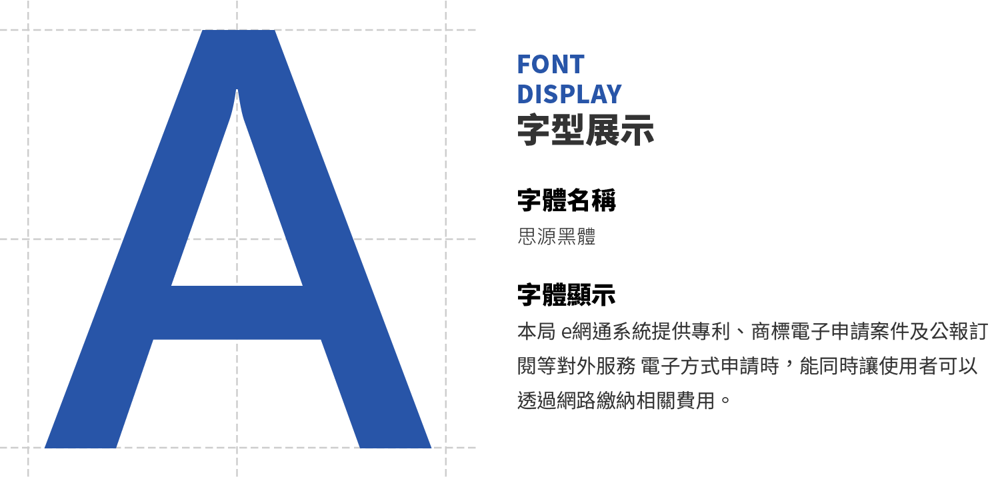
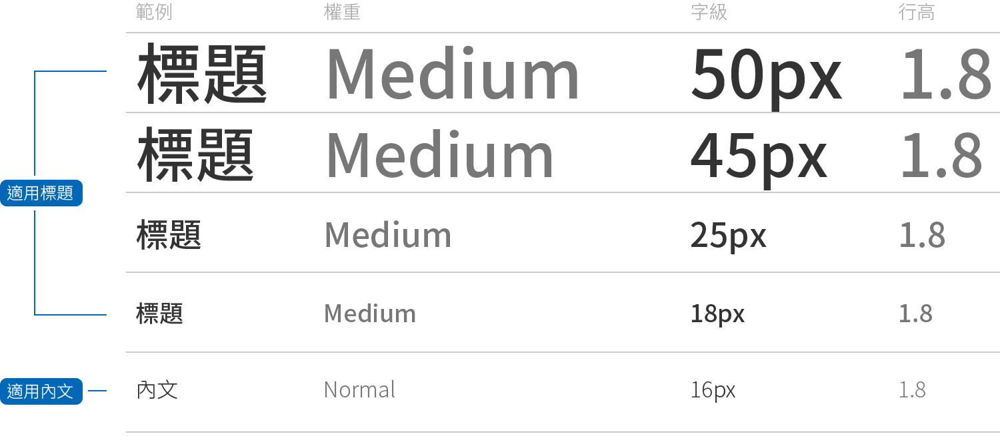

# 文字 Font

## 字型規範

本網站為RWD響應式網頁，設計時會以良好的使用者體驗為最終目標，因此採用Google Font 中的「思原黑體」作為顯示字體，在閱讀上既美觀且易閱讀。字體介紹如下：

## 字級規範

為了讓使用者不論年齡大小都能得到舒適的使用者體驗，所以畫面中標題與內文的字級建議大於16px，並不得小於14px。

| Word Level | Brief |
| :--- | :--- |
| 50px | 首頁快速選單標題 |
| 45px | 內頁大標題 |
| 25px | 內頁單元標題 |
| 18px | 單則訊息標題 / 區塊標題 / 步驟 |
| 16px | 內容 / 按鈕 |
| 14px | 附註 |
| 13px | 麵包屑 |

