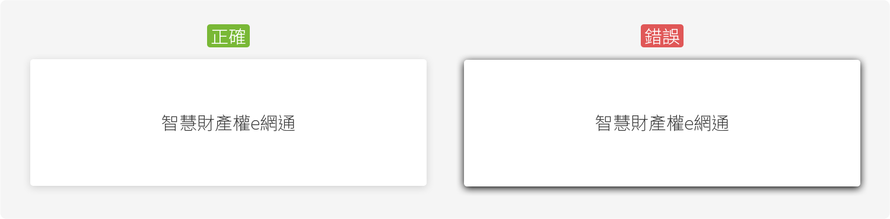
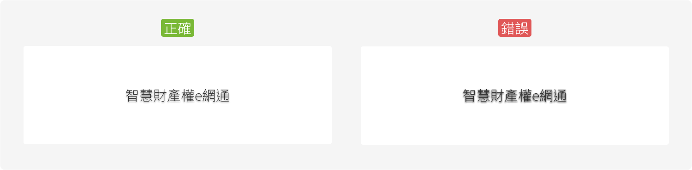

# 陰影 Shadow


建議的陰影設定如下：

| Name | Parameter | RGB Code | Transparent | Brief |
| :--- | :--- | :--- | :--- | :--- |
| 卡牌陰影 | X:0 , Y:3 , Blur:15 | ＃000000 | 15 % | 卡牌區塊 |
| 文字陰影 | X:0 , Y:0 , Blur:10 | ＃000000 | 10 % | 壓圖文字 |

## 卡牌陰影範例



使用陰影元素時以舒適且剛好能夠區分即可，勿以強烈的深色色彩做為陰影元素來使用，過於沉重的陰影元素會使畫面顯得生硬呆板。

```css
.BoxShadow{box-shadow:0px 3px 15px 0 rgba(0,0,0,.15);}
```

## 文字陰影範例



使用陰影元素時以舒適且剛好能夠區分即可，勿以強烈的深色色彩做為陰影元素來使用，過於沉重的陰影元素會使畫面顯得生硬呆板。

```css
.TextShadow{text-shadow:0px 2px 4px rgba(0,0,0,.4);}
```

