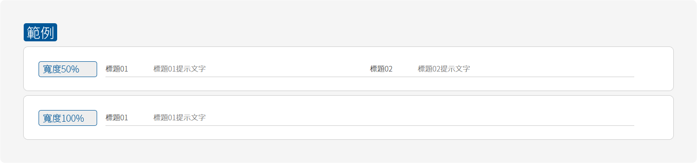
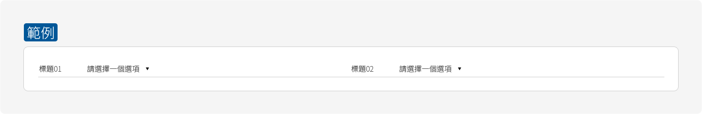
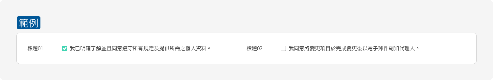

# 表單 Form

表單使用簡易的樣式呈現，避免在畫面中有過多的框使的視覺上成為複雜攏長表單。

表單區塊主要分為兩種尺寸，分為50%寬度與100%寬度的尺寸，依照當下所需要用到的範圍來訂定。如需要填寫或選項簡易時，使用到100%寬度的表單會使的畫面右側空洞且浪費了空間。有效的運用表單的尺寸配置優化使用者的表單體驗。

表單會有以下種類：

1. 輸入框 \( Input Box \)
2. 下拉選單 \( Select \)
3. 選擇 \( Radio Button \)
4. 核取 \( Check Box \)

以案件申請中的「線上變更案件基本資料」做為範例：

如需引用參數請前往「[元件 - 表單](../yuan-jian-component/biao-chan.md)」

