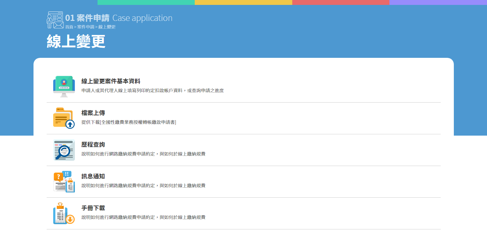

# 列表 List

在頁面中使用條列方式來做列表的顯示方式，整齊的排列在閱讀上可以有較順暢的體驗。另外搭配上合適的圖標做為視覺輔助，優化條列式列表樸素單調的問題。

在列表中的單一項目中會有著以下元素：

1. 合適的圖標 \( 66px\(W\) \* 66px\(H\) \)
2. 項目標題 \( 18px / Bold / \#333 \)
3. 項目輔助說明文案 \( 14px / \#333 \)

以案件申請中的「案件變更」做為範例：

在電腦版當中，如滑鼠移至該項目區域，滑鼠反應將圖標做放大之動畫效果，增加提示性。

