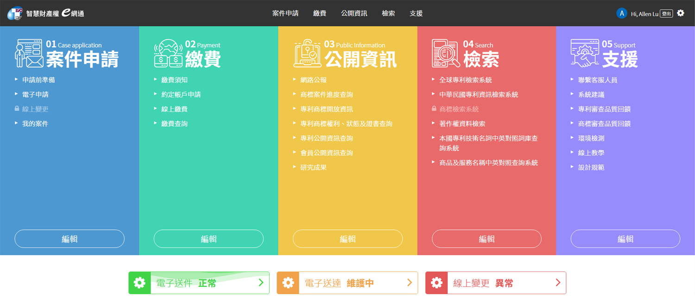
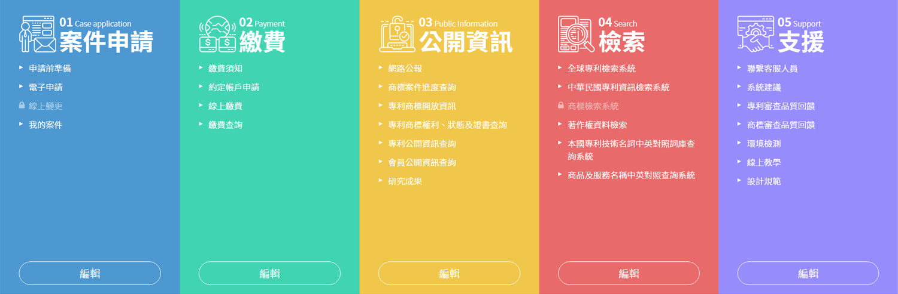

# 首頁 Index

首頁的固定順序如下：

* 第一區塊 - 將顯示頁首，並且固定於視窗上方。
* 第二區塊 - 將配置快速選單，使進入網站操作更加便捷快速。
* 第三區塊 - 安插服務狀態提醒使用者目前所提供之服務。

## 頁首

頁首詳細介紹請參閱『[佈局 - 頁首](../nei-rong/ye-shou-header.md)』

## 快速選單

在登入後會提供可編輯的服務，在使用上可以將快速選單編輯成更貼近個人習慣的操作方式。

## 服務狀態

服務狀態介紹請參閱『[元件 - 狀態](../yuan-jian-component/zhuang-tai-status.md)』

