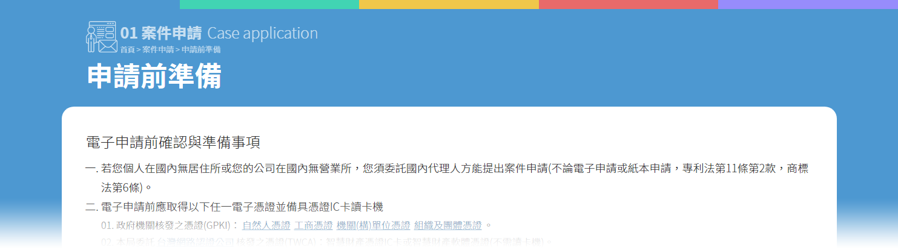

# 內容 Content

## 頁面資訊區塊


為了讓使用者清楚了解目前所在之架構，將首頁的色塊設計方式延伸至內頁當中。在頁首\(Header\)下方插入與首頁相同的色塊，並搭配該頁所屬色系區塊的資訊呈現，形成類似頁籤效果的表現方式。

在頁面中固定會呈現的資訊有：

1. 所屬架構Icon
2. 所屬架構名稱
3. 麵包屑導覽
4. 目前頁面名稱

以案件申請中的「申請前準備」為範例：



以下為上方示意圖之html/css代碼：

```markup
<div class="sortlines">
  <div class="grids"></div>
  <div class="grids"></div>
  <div class="grids"></div>
  <div class="grids"></div>
  <div class="grids"></div>
</div>
```

```css
.sortlines{ height:15px; font-size:0;}
.sortlines .grids{ display:inline-block; vertical-align:middle; height:15px; width:20%; background:#4d98d1;}
.sortlines .grids:nth-child(2){ background:#41d4b3;}
.sortlines .grids:nth-child(3){ background:#f0c74a;}
.sortlines .grids:nth-child(4){ background:#e86a6a;}
.sortlines .grids:nth-child(5){ background:#978cfc;}
```

