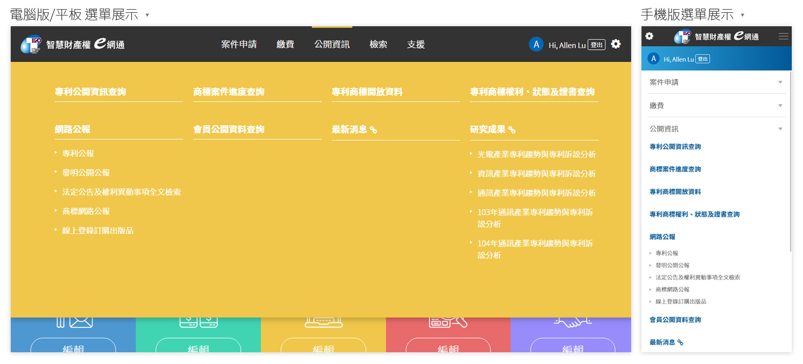

# 選單 Menu

### 電腦版與平板 

選單採用**巨型選單**\(Mega menu\)方式呈現，**巨型選單**能夠將所有的單元選項一次顯示出來，在尋找欲選擇項目時也更能清楚找到，**巨型選單**也有著響應式網頁的特性，隨著使用者的顯示器尺寸變更呈現方式。‌

### 手機版 

在較小的行動裝置將選單設定為**漢堡選單**\(Hamburger menu\)方式呈現，在空間有所限制時**漢堡選單**可以有效的將過多的選項暫時隱蔽，當需要時再點擊展開選單進行選擇。


當無權限選擇時會顯示 \(上鎖圖標\)


選單 HTML / CSS 於「[首頁 Header](ye-shou-header.md)」當中。

