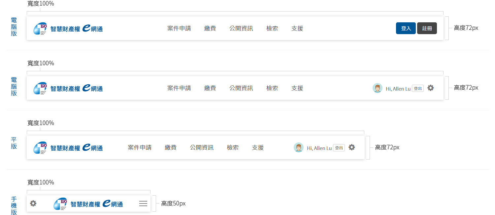
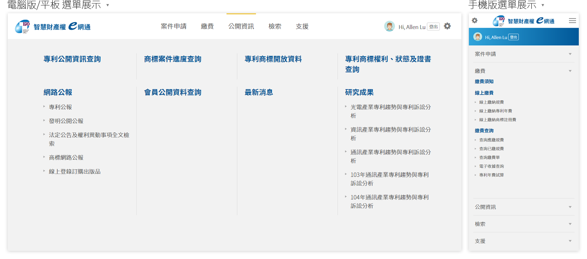

# 頁首 Header

### **電腦版**與**平板** 

頁首的構成主要分為3個區塊：‌

* 左側：放置「智慧財產權e網通」企業識別標章。
* 中間：顯示網站中所有的選單，依照不同單元有著不同顏色的色塊做為提示色。
* 右側：登入前顯示內容為「登入」與「註冊」內容。登入後顯示內容為「個人資訊」與「登出」。

### **手機版** 

頁首的構成主要分為3個區塊：‌

* 左側：登入前顯示內容為「登入」與「註冊」內容。登入後顯示內容為「個人資訊」與「登出」。
* 中間：放置「智慧財產權e網通」企業識別標章。
* 右側：顯示網站中所有的選單。

## 選單 

### 電腦版與平板 

選單採用**巨型選單**\(Mega menu\)方式呈現，**巨型選單**能夠將所有的單元選項一次顯示出來，在尋找欲選擇項目時也更能清楚找到，**巨型選單**也有著響應式網頁的特性，隨著使用者的顯示器尺寸變更呈現方式。‌

### 手機版 

在較小的行動裝置將選單設定為**漢堡選單**\(Hamburger menu\)方式呈現，在空間有所限制時**漢堡選單**可以有效的將過多的選項暫時隱蔽，當需要時再點擊展開選單進行選擇。

