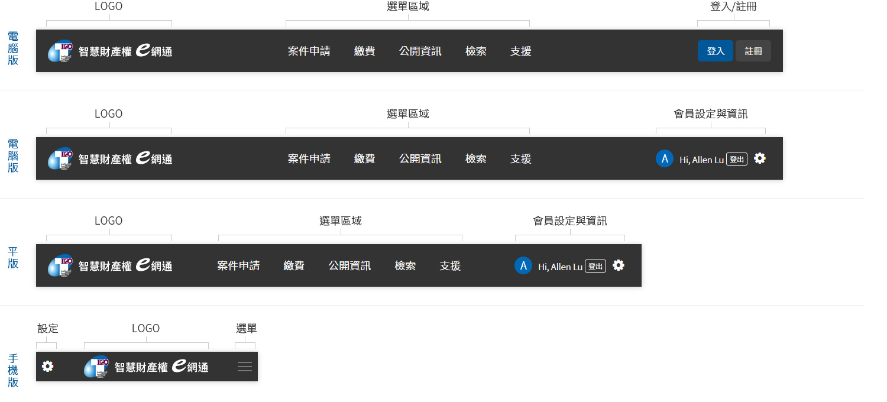

# 頁首 Header


### **電腦版**與**平板** <a id="dian-nao-ban-yu-ping-ban"></a>

頁首的構成主要分為3個區塊：‌

* 左側：放置「智慧財產權e網通」企業識別標章。
* 中間：顯示網站中所有的選單，依照不同單元有著不同顏色的色塊做為提示色。
* 右側：登入前顯示內容為「登入」與「註冊」內容。登入後顯示內容為「個人資訊」與「登出」。

### **手機版** <a id="shou-ji-ban"></a>

頁首的構成主要分為3個區塊：‌

* 左側：登入前顯示內容為「登入」與「註冊」內容。登入後顯示內容為「個人資訊」與「登出」。
* 中間：放置「智慧財產權e網通」企業識別標章。
* 右側：顯示網站中所有的選單。

## 資訊

以下為頁首尺寸圖：


以下為頁首介紹圖：



以下為頁首參考設定值：

```css
header{ width:100%; height:72px; background-color:#333; position:fixed; top:0; left:0; z-index:50;}
.logo{  width:210px; height:50px;}
.menu{ font-size:18px; color:#fff; padding:0 20px;}
```

以下為頁首 HTML / CSS 檔案下載：





