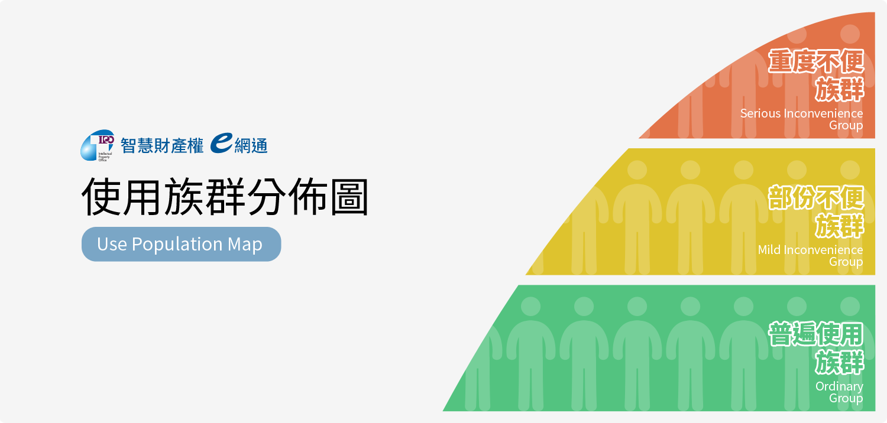

# 通用性設計 Accessible Design

Accessible Design的基本定義，是讓使用體驗的設計考量所有的使用者。 UI的設計以最大使用族群為對象，不需要經過特別的改良或調整，就能讓所有人操作的介面。是一種由從下到上的設計過程，以關注主流使用者體驗為原則。UX設計師在做設計時，不只是對於介面本身，同時更要注重整體體驗的可達性。但是在設計時如果因為過於具焦於系統本身功能，而忽略了以上的因素，就有可能產生了無意識的偏擺，而造成忽略了某一部份使用族群的操作特性。 因此為了讓無障礙性在UX設計時被考慮進去，請依循基本的可達性因素：

### 一、 單手操作的介面配置

讓介面的主要UX可以以單手完成功能操作，是一個開始考量的方向，現今的行動裝置使用是一個常見的情境，如果使用者方便以單手操作系統，就長遠而言可以加速達成工作的效率，以此為目標會，讓在其他使用情境下的使用者都能同時享受到設計帶來的效益，像是逛街拿著物品的使用者，或是在等待公車的使用者等等。

### 二、 文字大小的閱讀考量

將介面上的文字字級加大，對於視力障礙或是年紀較大的使用者，是非常貼心且重要的考量。的確許多設計師在進行視覺設計時，會考慮留白或是小字級的文字對於整體視覺美感的影響，但是現實中許多使用者其實更需要的是實際操作上面的簡易性。

### 三、 顏色對比的視覺設計

在畫面上對於訊息內容與背景的顏色對比，會對使用者的內容傳遞上產生重要的影響，過於接近的顏色調配，會讓使用者難以閱讀，同時考量到色盲使用者可能無法區分顏色的差異，因此建議要搭配容易清楚傳達訊息的文字，更能夠配合各種使用條件。

### 四、 簡要清楚的功能安排

簡潔有條理的資訊架構，順暢的導覽安排以及可預期的操作結果，不須教育訓練的使用方式以及一致性的使用體驗，都能讓產品的設計符合大多數人的使用情境。

