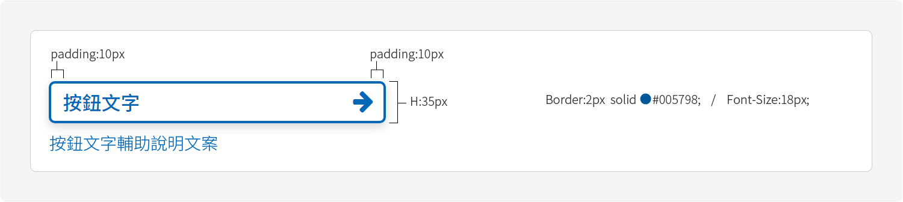

# 按鈕 Button

## 「進入」或「下一步」用按鈕



滑鼠反應只在電腦版本當中會出現，在行動裝置瀏覽時不會出現滑鼠反應。


```css
/*--預設樣式--*/
.button{ height:42px; line-height:42px; background-color:#005798; padding:0 20px; font-size:18px; color:#fff; transition:.2s;}

/*--反應樣式--*/
.button:hover{ background-color:#0c6eb7; transition:.2s;}
```

### 「外部連結」用按鈕



