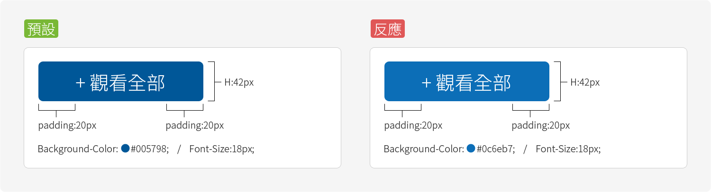

# 按鈕 Button

進入或下一步之使用按鈕



```css
/*--預設樣式--*/
.button{ height:42px; line-height:42px; background-color:#005798; padding:0 20px; font-size:18px; color:#fff; transition:.2s;}

/*--反應樣式--*/
.button:hover{ background-color:#0c6eb7; transition:.2s;}
```

