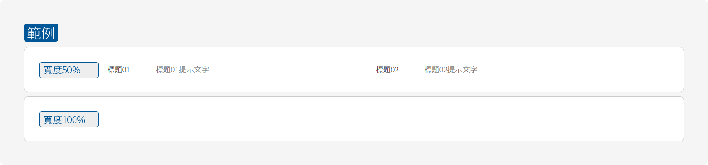
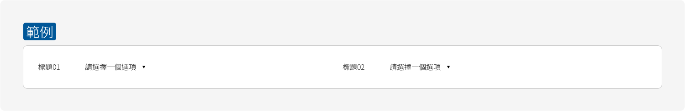
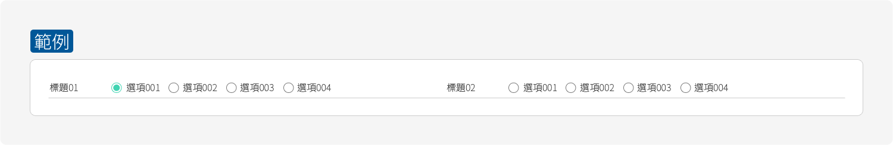
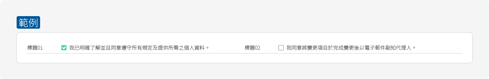

# 表單 Form

表單當中包含著不同種類的功能，而當中會有以下種類：

1. 輸入框 \( Input Box \)
2. 下拉選單 \( Select \)
3. 選擇 \( Radio Button \)
4. 核取 \( Check Box \)

## 輸入框 \( Input Box \)



表單區塊主要分為兩種尺寸，分為50%寬度與100%寬度的尺寸，依照當下所需要用到的範圍來訂定。如需要填寫或選項簡易時，使用到100%寬度的表單會使的畫面右側空洞且浪費了空間。有效的運用表單的尺寸配置優化使用者的表單體驗。

以下為輸入框設定值：

```css
/*--區塊--*/
.block{ padding-bottom:5px; border-bottom:1px solid #ccc; margin-bottom:15px;}

/*--標題--*/
.title{ font-size:16px; color:#333; line-height:26px;}

/*--輸入框--*/
.input{ border:none; background:none; line-height:26px; height:26px; font-size:16px; color:#333; padding:0 3px;}
```

## 下拉選單 \( Select \)



以下為下拉選單設定值：

```css
/*--區塊--*/
.block{ padding-bottom:5px; border-bottom:1px solid #ccc; margin-bottom:15px;}

/*--標題--*/
.title{ font-size:16px; color:#333; line-height:26px;}

/*--輸入框--*/
.select{ border:none; background:none; line-height:26px; height:26px; font-size:16px; color:#333; padding:0 3px;}
```

## 選擇 \( Radio Button \)



以下為下拉選單設定值：

```css
/*--區塊--*/
.block{ padding-bottom:5px; border-bottom:1px solid #ccc; margin-bottom:15px;}

/*--標題--*/
.title{ font-size:16px; color:#333; line-height:26px;}

/*--選項選擇前--*/
.radio{ width:16px; height:16px; border:1px solid #777; display:inline-block; vertical-align:middle; border-radius:50%; -webkit-border-radius:50%; -moz-border-radius:50%; position:relative;}
.point{ width:10px; height:10px; background:none; border-radius:50%; -webkit-border-radius:50%; -moz-border-radius:50%;}

/*--選項選擇後--*/
.radio{ border-color:#40d4b2;}
.point{ background:#40d4b2;}
```

## 核取 \( Check Box \)



以下為下拉選單設定值：

```css
/*--區塊--*/
.block{ padding-bottom:5px; border-bottom:1px solid #ccc; margin-bottom:15px;}

/*--標題--*/
.title{ font-size:16px; color:#333; line-height:26px;}

/*--選項選擇前--*/
.checkbox{ width:16px; height:16px; border:1px solid #777; display:inline-block; vertical-align:middle; border-radius:2px; -webkit-border-radius:2px; -moz-border-radius:2px; position:relative;}
.tick{ color:transparent;}

/*--選項選擇後--*/
.checkbox{ border-color:#40d4b2;}
.tick{ color:#ffffff;}
```

