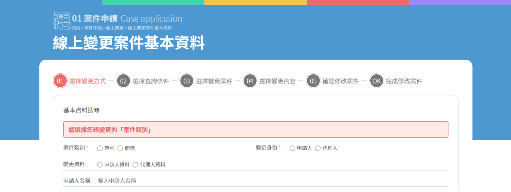
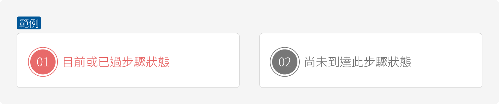
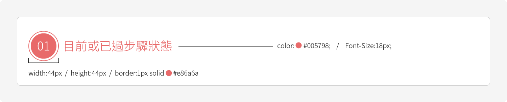

# 步驟 Step



以下為兩種狀態示意。



以下為單個步驟規格簡述。



以下為上方示意圖之css參考代碼：

```css
/*--圓框--*/
.border{ width:44px; height:44px; border:1px solid #ccc; background:#fff; border-radius:50%; -webkit-border-radius:50%; -moz-border-radius:50%;}

/*--圓底步驟數--*/
.step{ width:38px; height:38px; background:#777; text-align:center; color:#fff; font-size:18px; border-radius:50%; -webkit-border-radius:50%; -moz-border-radius:50%;}

/*--步驟文案--*/
.word{ color:#777; font-size:18px; margin-left:5px;}

/*--步驟線--*/
.line{ width:15px; height:1px; background:#ccc;}

/*--目前或已過步驟--*/
.border{ border-color:#e86a6a;}
.step{ backgrounf-color:#e86a6a;}
.word{ color:#e86a6a;}
.line{ backgrounf-color:#e86a6a;}
```

