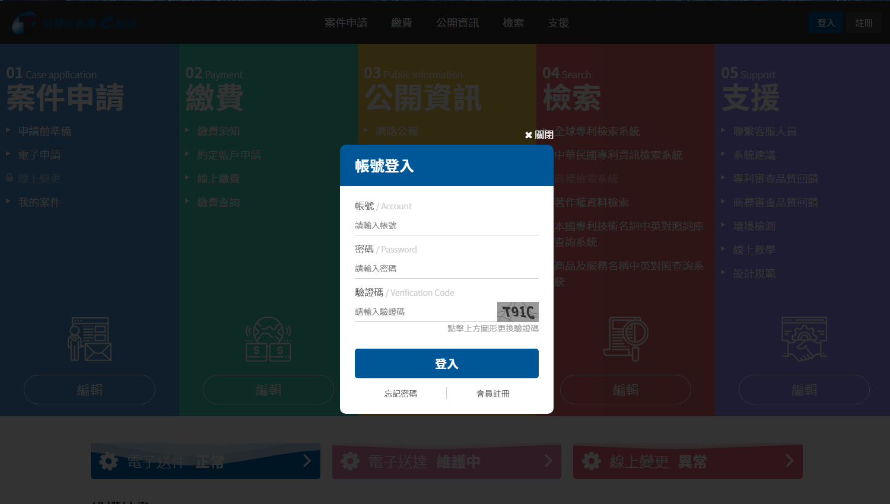

# 光箱 Light Box

光箱的用途在於，當頁面需要額外的功能時，跳出較小視窗來提供操作。使用者可以執行光箱中的選項來進一步使用接下來的功能。

由首頁時的登入做為示意：



以下為光箱設定值：

```css
/*--黑底--*/
.bg{ background:rgba(0,0,0,.8);}

/*--光箱區塊--*/
.lightbox{ border-radius:10px; background:#fff;}

​/*--光箱標題--*/
.lightbox_title{ background:#005798; font-size:25px; color:#fff; font-weight:bold; padding:0 25px; line-height:70px;}
 
/*--光箱中文小標--*/
.word{ color:#333; font-size:16px;}
 
/*--光箱英文小標--*/
.word{ color:#ccc; font-size:14px;}

/*--光箱輸入框--*/
input{ border-bottom:1px solid #ccc; font-size:14px; line-height:34px; height:34px; color:#333;}

/*--關閉按鈕--*/
.close{ font-size:16px; color:#fff;}
```

