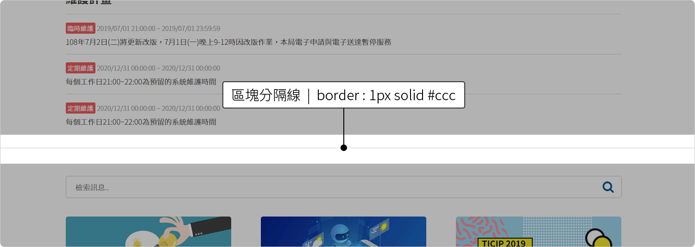
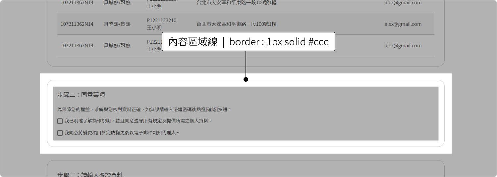
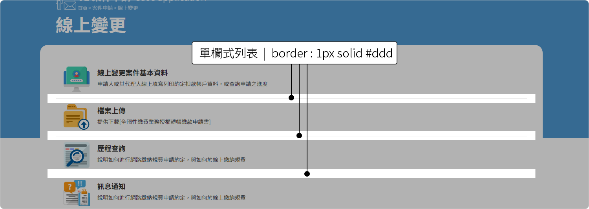
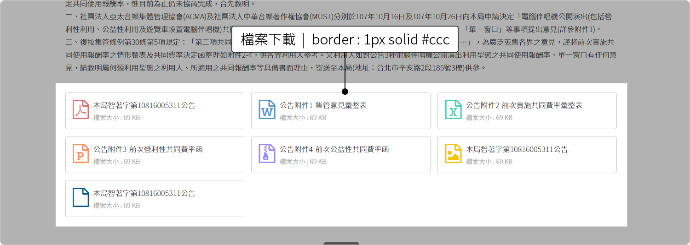
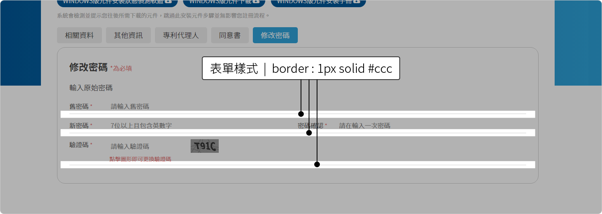
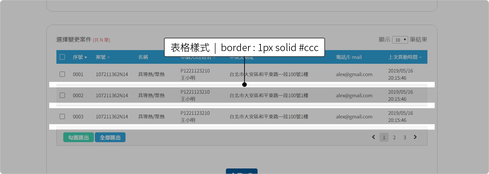
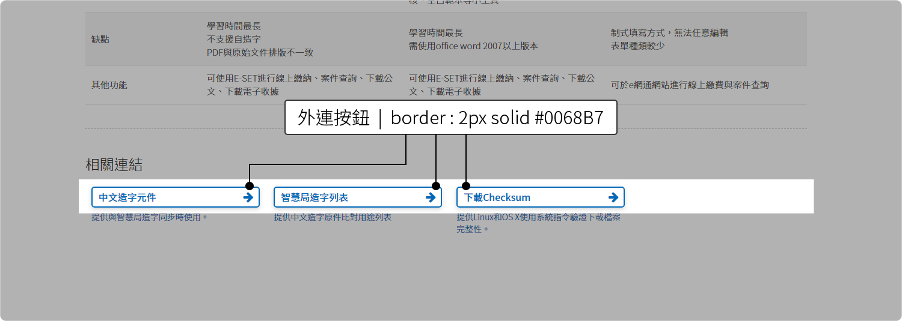
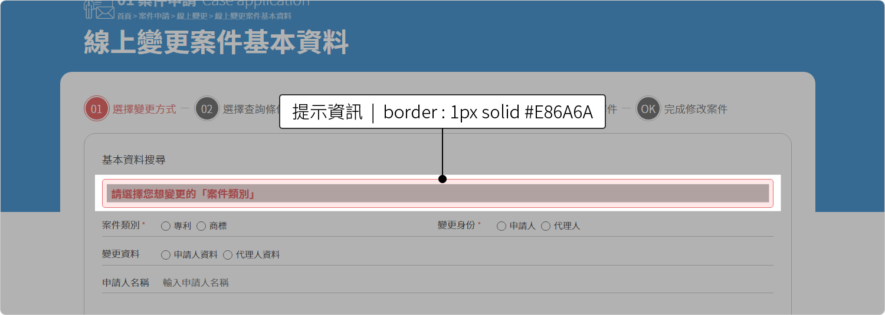

# 框線 Border

在本網站中，所有邊框或分隔線以**1px**為主，而顏色將視情況而訂定。參考如下：

| 情境 | 尺寸 | 樣式 | 顏色 |
| :--- | :--- | :--- | :--- |
| 區塊分隔線 | 1px | Solod | \#CCCCCC |
| 內容分段線 | 1px | Dashed | \#CCCCCC |
| 內容區域線 | 1px | Solid | \#CCCCCC |
| 單欄式列表 | 1px | Solod | \#DDDDDD |
| 檔案下載 | 1px | Solod | \#CCCCCC |
| 表單樣式 | 1px | Solod | \#CCCCCC |
| 表格樣式 | 1px | Solid | \#CCCCCC |
| 外連按鈕 | 2px | Solid | \#0068B7 |
| 提示資訊 | 1px | Solid | \#E86A6A |

## 框線示意

#### 區塊分隔線



```css
border{ border-bottom:1px solid #ccc;}
```

#### 內容分段線


```css
border{ border-bottom:1px solid #ccc;}
```

#### 內容區域線



```css
border{ border:1px solid #ccc;}
```

#### 單欄式列表



```css
border{ border-bottom:1px solid #ddd;}
```

#### 檔案下載



```css
border{ border:1px solid #ccc;}
```

#### 表單樣式



```css
border{ border-bottom:1px solid #ccc;}
```

#### 表格樣式



```css
border{ border-bottom:1px solid #ccc;}
```

#### 外連按鈕



```css
border{ border:2px solid #0068b7;}
```

#### 提示資訊



```css
border{ border:1px solid #e86a6a;}
```

