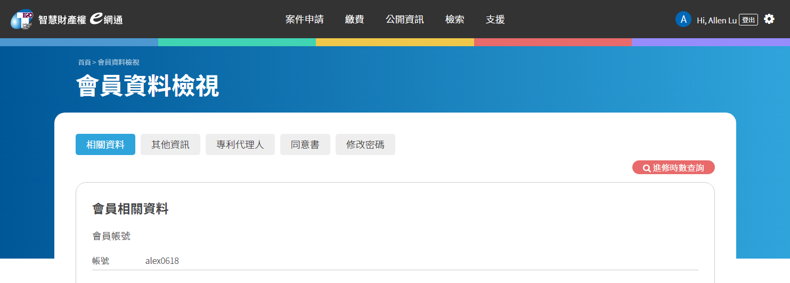
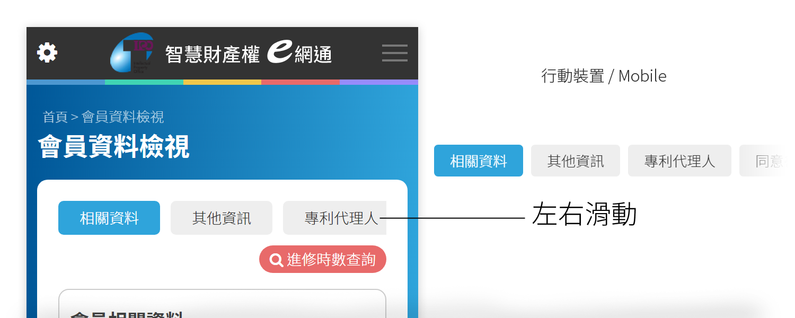
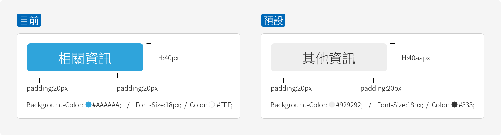

# 頁籤 Page Label

使用頁籤可將類似資訊在同頁顯示，不必等待轉頁時間，對於使用者體驗更加友善。

以「會員資料檢視」做為範例：





以下為兩種狀態示意：



以下為上方示意圖參考html/css代碼：

```markup
<div class="scrollName">
  <div class="range">
    <div class="grids hold">相關資料</div>
    <div class="grids">其他資訊</div>
    <div class="grids">專利代理人</div>
    <div class="grids">同意書</div>
    <a href="6-2-2_change_password.html" class="grids">修改密碼</a>
  </div>
</div>
```

```css
/*--預設樣式--*/
.reviewclass{ font-size:0; margin-bottom:10px; }
.reviewclass .grids{ display: inline-block; vertical-align: middle; margin: 0 10px 0 0; color: #333; font-size: 18px; line-height: 40px; padding: 0 20px; background: #eee; border-radius: 5px; -webkit-border-radius: 5px; -moz-border-radius: 5px; text-decoration: none; cursor: pointer; }
/*--目前樣式--*/
.reviewclass .grids.hold{ background:#2fa4db; color:#fff; }
```

以下為滑動功能的參考css/js代碼：

```javascript
var slider;
var isDown = false;
var startX;
var scrollLeft;

$(function(){
	slider = document.querySelector('.scrollName .range');
	slider.addEventListener('mousedown', function(e){
		isDown = true;
		startX = e.pageX - slider.offsetLeft;
		scrollLeft = slider.scrollLeft;
	});
	slider.addEventListener('mouseleave', function(){
		isDown = false;
	});
	slider.addEventListener('mouseup', function(){
		isDown = false;
	});
	slider.addEventListener('mousemove', function(e){
		if(!isDown) return;
		e.preventDefault();
		var x = e.pageX - slider.offsetLeft;
		var walk = (x - startX) * 3; //scroll-fast
		slider.scrollLeft = scrollLeft - walk;
	});
});
```

```css
/*--滑動-基礎樣式--*/
.scrollName{ overflow-y: hidden; height:40px; }
.scrollName > * > *{ overflow-x: scroll; white-space: nowrap; }
.scrollName > * > * > *{ text-decoration: none; }
```

